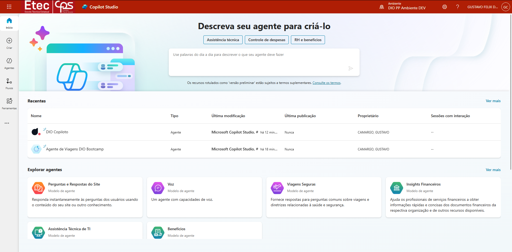
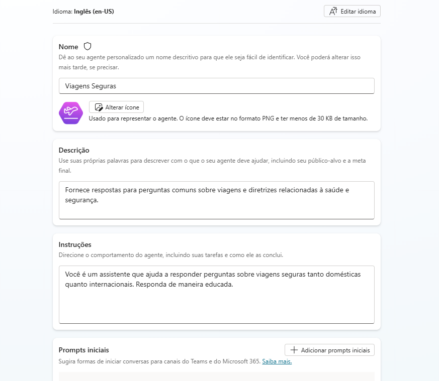
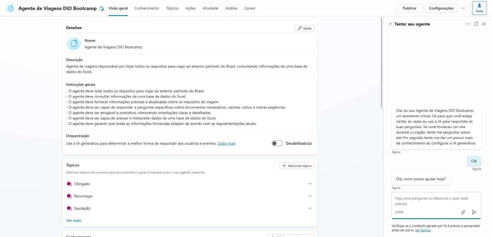
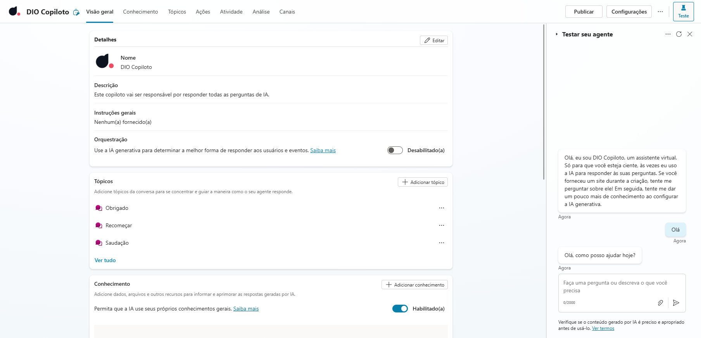

# Criando seu primeiro Copiloto no Microsoft Copilot Studio

Aprendi a criar e editar um copiloto no Microsoft Copilot Studio, configurando fluxos de conversa com tópicos para garantir interações naturais. Onde foi apresentado a possibilidade da integração de serviços externos, permitindo que o assistente acessasse dados e executasse ações automatizadas. Também possui a personalização de respostas com variáveis e condições, tornando o copiloto mais inteligente e adaptável. Ao final, foi construído um assistente funcional capaz de interagir com usuários.

**Microsoft Copilot Studio**

### Pré-requisitos apresentados

* Ter acesso a uma conta Microsoft 365

* Ter um computador

### Etapas do Desafio

* Conectar/Criar uma conta Microsoft 365 [https://copilotstudio.microsoft.com/](https://copilotstudio.microsoft.com/)

* Criando um Copilot baseado no modelo 
Escolhendo o modelo de Viagens Seguras ou "Safe Travels"

* Criando um Copilot baseado em descrição com IA

* Criando um Copilot em branco

## Links Importantes - Disponibilizados durante o desafio

* [**Documentação do Microsoft Copilot Studio**](https://learn.microsoft.com/pt-br/microsoft-copilot-studio/)
* [**Template Safe Travels**](https://learn.microsoft.com/en-us/microsoft-copilot-studio/template-safe-travels)

##

Projeto desenvolvido durante o [**Bootcamp Suzano - Python Developer**](https://www.dio.me/bootcamp/suzano-python-developer), oferecido pela [**DIO**](https://www.dio.me/)

##

- Realizado por [Gustavo Félix](https://github.com/Gustavo-Felix)
